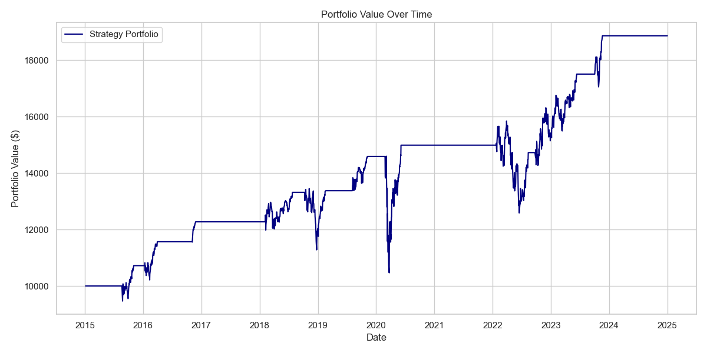
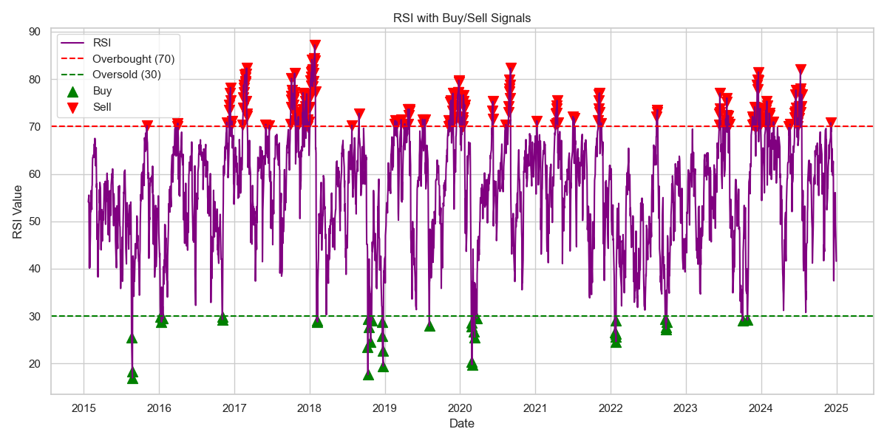

# 📈 RSI Trading Strategy Backtest

This project implements a simple RSI (Relative Strength Index) based trading strategy on $SPY (S&P 500 ETF) using Python.  
The goal was to simulate a basic rule-based strategy, evaluate its risk-adjusted performance, and visualize key trading signals.

---

## ⚙️ Project Structure

- **src/** → Source code for data loading, strategy logic, metrics calculation, and plotting
- **data/** → Historical SPY data
- **output/** → Backtest results and charts
- **requirements.txt** → Project dependencies

---

## 📊 Strategy Logic

- **Buy** when RSI < 30 (oversold)
- **Sell** when RSI > 70 (overbought)
- Start with $10,000, all-in on each buy
- No leverage, no short selling

---

## 📈 Portfolio Performance

---

## 📉 RSI Buy/Sell Signals

---

## 📑 Key Metrics

| Metric         | Value  |
|----------------|--------|
| CAGR           | 9.23%  |
| Volatility     | 14.23% |
| Sharpe Ratio   | 0.52   |
| Max Drawdown   | -17.2% |

---

## 🛠️ Technologies Used

- Python
- Pandas
- yfinance
- pandas-ta
- Matplotlib
- Seaborn
- GitHub version control

---

## 🚀 Potential Future Improvements

- Add different strategies (Moving Average Crossover strategy, buy and hold, etc) for strategy comparison
- Multi Asset support
- Plot Drawdown Curve
- Streamlit dashboard for dynamic visualization
- Parameter optimization for best RSI thresholds

---

## 👨‍💻 Author

**Arthur Fritscheck**  
[LinkedIn](https://www.linkedin.com/in/arthurfritscheck/) 
[Github](https://github.com/arthurfritscheck)

